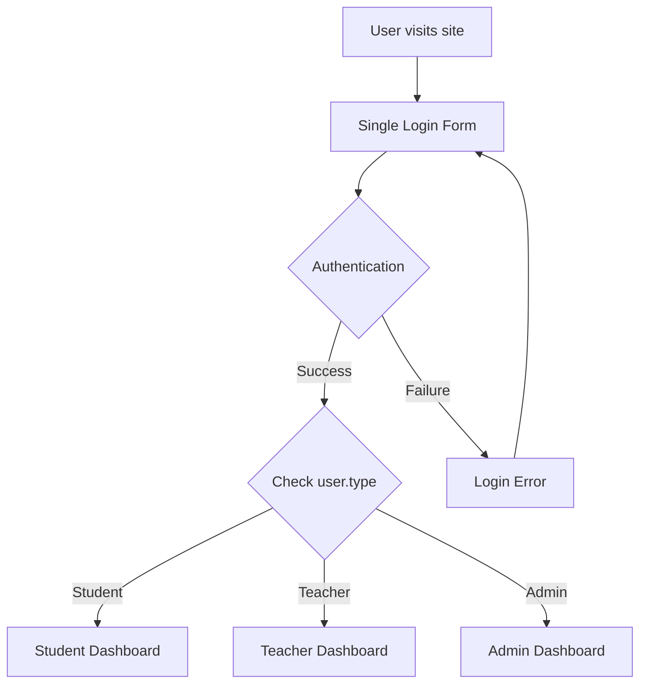
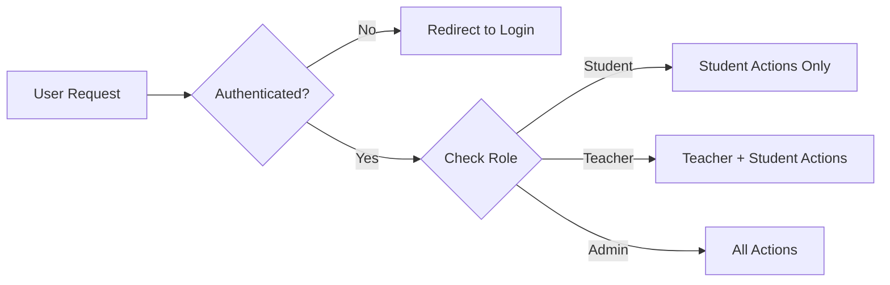

# Enhanced Student Authentication Implementation Plan
## Single Login with Teacher Management Features

## 1. Executive Summary

This plan implements a teacher-managed student authentication system using a single, enhanced login interface. The approach leverages the existing Single Table Inheritance (STI) structure with `User`, `Student`, and `Teacher` classes while adding comprehensive teacher management capabilities.

## 2. Current System Analysis

### Existing Infrastructure
- **STI Structure**: `User` base class with `Student` and `Teacher` subclasses
- **Authentication**: Devise with username-based login (email optional)
- **Database**: `users` table with `type` column for STI discrimination
- **Current Login**: Single form at `/users/sign_in` using username/password

### Key Strengths to Leverage
- ✅ STI structure already in place
- ✅ Username-based authentication working
- ✅ Devise integration complete
- ✅ Basic role differentiation via `type` column

## 3. Implementation Architecture

### 3.1 Authentication Flow Enhancement



### 3.2 Role-Based Authorization



## 4. Detailed Implementation Plan

### Phase 1: Enhanced Authentication & Authorization (Week 1-2)

#### 4.1 Application Controller Enhancement
**File**: `app/controllers/application_controller.rb`

```ruby
class ApplicationController < ActionController::Base
  before_action :authenticate_user!
  before_action :configure_permitted_parameters, if: :devise_controller?

  protected

  def after_sign_in_path_for(resource)
    case resource.type
    when 'Student'
      portfolio_path(resource)
    when 'Teacher', 'Admin'
      classrooms_path
    else
      root_path
    end
  end

  def ensure_teacher_or_admin
    redirect_to root_path unless current_user&.teacher_or_admin?
  end

  def ensure_admin
    redirect_to root_path unless current_user&.admin?
  end

  private

  def configure_permitted_parameters
    devise_parameter_sanitizer.permit(:sign_up, keys: [:username, :type, :classroom_id])
    devise_parameter_sanitizer.permit(:account_update, keys: [:username, :email])
  end
end
```

#### 4.2 User Model Enhancement
**File**: `app/models/user.rb`

```ruby
class User < ApplicationRecord
  belongs_to :classroom
  has_one :portfolio, dependent: :destroy
  has_many :orders, dependent: :destroy

  devise :database_authenticatable, :registerable,
         :recoverable, :rememberable, :validatable

  validates :email, uniqueness: true, presence: false, allow_blank: true
  validates :username, presence: true, uniqueness: true
  validates :type, inclusion: {in: %w[User Student Teacher]}

  scope :students, -> { where(type: 'Student') }
  scope :teachers, -> { where(type: 'Teacher') }
  scope :admins, -> { where(admin: true) }

  def student?
    type == 'Student'
  end

  def teacher?
    type == 'Teacher'
  end

  def teacher_or_admin?
    teacher? || admin?
  end

  def display_name
    username.presence || email&.split('@')&.first || 'User'
  end

  def email_required?
    teacher? || admin?
  end

  def email_changed?
    false
  end
end
```

#### 4.3 Enhanced Routes Configuration
**File**: `config/routes.rb`

```ruby
Rails.application.routes.draw do
  get "up" => "rails/health#show", :as => :rails_health_check

  devise_for :users, controllers: {
    sessions: 'users/sessions',
    registrations: 'users/registrations'
  }

  # Role-based root routing
  authenticated :user, ->(user) { user.student? } do
    root 'students/dashboard#index', as: :student_root
  end

  authenticated :user, ->(user) { user.teacher_or_admin? } do
    root 'teachers/dashboard#index', as: :teacher_root
  end

  root "users/sessions#new"

  # Student management routes (nested under classrooms)
  resources :classrooms do
    resources :students, only: [:new, :create, :edit, :update, :destroy] do
      member do
        patch :reset_password
        patch :generate_password
      end
      collection do
        post :bulk_create
        get :bulk_template
      end
    end
  end

  # Admin namespace (existing)
  namespace :admin do
    root to: "classrooms#index"
    resources :classrooms
    resources :portfolio_transactions, except: [:index]
    resources :school_years, except: %i[new edit]
    resources :schools
    resources :stocks
    resources :students
    resources :teachers
    resources :users
    resources :years
  end

  # Shared resources
  resources :classrooms, only: [:index, :show]
  resources :orders, only: [:show]
  resources :portfolios, only: :show
  resources :stocks, only: %i[show index]
  resources :schools, only: [:index, :show]
end
```

### Phase 2: Teacher Management Features (Week 3-4)

#### 4.4 Enhanced Classrooms Controller
**File**: `app/controllers/classrooms_controller.rb`

```ruby
class ClassroomsController < ApplicationController
  before_action :set_classroom, only: %i[show edit update destroy]
  before_action :authenticate_user!
  before_action :ensure_teacher_or_admin, except: [:index, :show]

  def index
    @classrooms = current_user.teacher_or_admin? ? Classroom.all : [current_user.classroom].compact
  end

  def show
    # Enhanced to include student management capabilities for teachers
    @students = @classroom.users.students.includes(:portfolio, :orders)
    @can_manage_students = current_user.teacher_or_admin?
    @classroom_stats = calculate_classroom_stats if @can_manage_students
  end

  # ... existing methods remain the same ...

  private

  def set_classroom
    @classroom = Classroom.includes(users: :portfolio).find(params[:id].to_i)
  end

  def classroom_params
    params.require(:classroom).permit(:name, :grade, :school_name, :year_value)
  end

  def ensure_teacher_or_admin
    redirect_to root_path unless current_user&.teacher_or_admin?
  end

  def calculate_classroom_stats
    return {} unless @classroom

    students = @classroom.users.students
    {
      total_students: students.count,
      active_students: students.joins(:orders).distinct.count,
      total_portfolio_value: students.joins(:portfolio).sum('portfolios.current_position'),
      recent_orders_count: Order.joins(:user).where(users: { classroom: @classroom }).where('orders.created_at > ?', 1.week.ago).count
    }
  end
end
```

#### 4.5 Student Management Controller (Nested under Classrooms)
**File**: `app/controllers/students_controller.rb`

```ruby
class Teachers::StudentsController < ApplicationController
  before_action :ensure_teacher_or_admin
  before_action :set_student, only: [:show, :edit, :update, :destroy, :reset_password, :toggle_active]

  def index
    @students = current_user.classroom&.users&.students || User.none
    @students = @students.includes(:portfolio, :orders)
                        .order(:username)
  end

  def new
    @student = Student.new(classroom: current_user.classroom)
  end

  def create
    @student = Student.new(student_params)
    @student.classroom = current_user.classroom
    @student.password = generate_temporary_password

    if @student.save
      create_student_portfolio
      redirect_to teachers_students_path, 
                  notice: "Student #{@student.username} created successfully. Temporary password: #{@student.password}"
    else
      render :new, status: :unprocessable_entity
    end
  end

  def edit
  end

  def update
    if @student.update(student_params.except(:password))
      redirect_to teachers_students_path, notice: 'Student updated successfully.'
    else
      render :edit, status: :unprocessable_entity
    end
  end

  def destroy
    username = @student.username
    @student.destroy
    redirect_to teachers_students_path, notice: "Student #{username} deleted successfully."
  end

  def reset_password
    new_password = generate_temporary_password
    @student.update!(password: new_password)
    redirect_to teachers_students_path, 
                notice: "Password reset for #{@student.username}. New password: #{new_password}"
  end

  def toggle_active
    # Implementation depends on how you want to handle active/inactive students
    # Could add an 'active' boolean column to users table
    redirect_to teachers_students_path, notice: 'Student status updated.'
  end

  def bulk_create
    results = BulkStudentCreator.new(
      classroom: current_user.classroom,
      csv_data: params[:csv_file]
    ).call

    if results[:success]
      redirect_to teachers_students_path, 
                  notice: "#{results[:created_count]} students created successfully."
    else
      redirect_to teachers_students_path, 
                  alert: "Bulk creation failed: #{results[:errors].join(', ')}"
    end
  end

  def bulk_template
    send_data generate_csv_template, 
              filename: 'student_bulk_template.csv',
              type: 'text/csv'
  end

  private

  def set_student
    @student = current_user.classroom.users.students.find(params[:id])
  end

  def student_params
    params.require(:student).permit(:username, :email)
  end

  def generate_temporary_password
    SecureRandom.alphanumeric(8)
  end

  def create_student_portfolio
    Portfolio.create!(user: @student, current_position: 10000.0) # Starting balance
  end

  def generate_csv_template
    CSV.generate do |csv|
      csv << ['username', 'email']
      csv << ['student1', 'student1@example.com']
      csv << ['student2', 'student2@example.com']
    end
  end
end
```

#### 4.6 Bulk Student Creator Service
**File**: `app/services/bulk_student_creator.rb`

```ruby
class BulkStudentCreator
  def initialize(classroom:, csv_data:)
    @classroom = classroom
    @csv_data = csv_data
  end

  def call
    return { success: false, errors: ['No CSV file provided'] } unless @csv_data

    students_data = parse_csv
    return { success: false, errors: ['Invalid CSV format'] } if students_data.empty?

    created_students = []
    errors = []

    students_data.each do |student_data|
      student = create_student(student_data)
      if student.persisted?
        created_students << student
        create_portfolio_for_student(student)
      else
        errors << "Failed to create #{student_data[:username]}: #{student.errors.full_messages.join(', ')}"
      end
    end

    {
      success: errors.empty?,
      created_count: created_students.count,
      errors: errors,
      students: created_students
    }
  end

  private

  def parse_csv
    CSV.parse(@csv_data.read, headers: true).map do |row|
      {
        username: row['username']&.strip,
        email: row['email']&.strip
      }
    end.reject { |data| data[:username].blank? }
  rescue CSV::MalformedCSVError
    []
  end

  def create_student(student_data)
    Student.create(
      username: student_data[:username],
      email: student_data[:email],
      password: SecureRandom.alphanumeric(8),
      classroom: @classroom
    )
  end

  def create_portfolio_for_student(student)
    Portfolio.create!(user: student, current_position: 10000.0)
  end
end
```

### Phase 3: Enhanced UI/UX (Week 5-6)

#### 4.7 Enhanced Login Form
**File**: `app/views/devise/sessions/new.html.erb`

```erb
<div class="flex min-h-full flex-col justify-center px-6 py-12 lg:px-8">
  <div class="sm:mx-auto sm:w-full sm:max-w-sm">
    <div class="flex w-full justify-center">
      <%= image_tag "SITF-caponly-Logo.svg", class: "navbar-logo", alt: "Stocks in The Future" %>
    </div>

    <h2 class="text-center text-2xl/9 font-bold tracking-tight text-gray-900 pb-4">
      Sign in to your account
    </h2>

    <!-- Login Type Indicator -->
    <div class="mb-4 p-3 bg-blue-50 rounded-md">
      <p class="text-sm text-blue-700">
        <strong>Students:</strong> Use your username and password<br>
        <strong>Teachers:</strong> Use your username or email and password
      </p>
    </div>

    <%= render_form_for(resource, as: resource_name, url: session_path(resource_name)) do |f| %>
      <div class="space-y-4">
        <%= f.text_field :login, 
            placeholder: "Username or Email", 
            autocomplete: "username", 
            class: "block w-full rounded-md bg-white px-3 py-1.5 text-base text-gray-900 outline-1 -outline-offset-1 outline-gray-300 placeholder:text-gray-400 focus:outline-2 focus:-outline-offset-2 focus:outline-indigo-600 sm:text-sm/6" %>
        
        <%= f.password_field :password, 
            placeholder: "Password", 
            autocomplete: "current-password", 
            class: "block w-full rounded-md bg-white px-3 py-1.5 text-base text-gray-900 outline-1 -outline-offset-1 outline-gray-300 placeholder:text-gray-400 focus:outline-2 focus:-outline-offset-2 focus:outline-indigo-600 sm:text-sm/6" %>

        <div class="flex items-center justify-between">
          <% if devise_mapping.rememberable? %>
            <%= render_checkbox name: "user[remember_me]", label: "Remember Me" %>
          <% end %>

          <%= render_button "Forgot your password?", 
              href: new_password_path(resource_name), 
              variant: :ghost, 
              class: "text-sm font-semibold text-[#00698C] hover:text-blue-500", 
              as: :link %>
        </div>

        <%= render_button "Sign in", 
            class: "flex w-full justify-center rounded-md bg-[#00698C] px-3 py-1.5 text-sm/6 text-white shadow-xs hover:bg-blue-500 focus-visible:outline-2 focus-visible:outline-offset-2 focus-visible:outline-blue-600", 
            type: "submit" %>

        <!-- Teacher Registration Link (Admin Only) -->
        <% if current_user&.admin? %>
          <%= render_button "Create Teacher Account", 
              href: new_registration_path(resource_name), 
              variant: :ghost, 
              class: "inline-block w-full text-sm text-center underline", 
              as: :link %>
        <% end %>
      </div>
    <% end %>
  </div>
</div>
```

#### 4.8 Teacher Dashboard View
**File**: `app/views/teachers/dashboard/index.html.erb`

```erb
<div class="max-w-7xl mx-auto px-4 sm:px-6 lg:px-8">
  <div class="py-6">
    <h1 class="text-3xl font-bold text-gray-900">Teacher Dashboard</h1>
    <p class="mt-2 text-gray-600">Manage your classroom: <%= @classroom&.name || 'No classroom assigned' %></p>
  </div>

  <!-- Stats Cards -->
  <div class="grid grid-cols-1 md:grid-cols-2 lg:grid-cols-4 gap-6 mb-8">
    <div class="bg-white overflow-hidden shadow rounded-lg">
      <div class="p-5">
        <div class="flex items-center">
          <div class="flex-shrink-0">
            <div class="w-8 h-8 bg-blue-500 rounded-md flex items-center justify-center">
              <span class="text-white font-bold"><%= @classroom_stats[:total_students] %></span>
            </div>
          </div>
          <div class="ml-5 w-0 flex-1">
            <dl>
              <dt class="text-sm font-medium text-gray-500 truncate">Total Students</dt>
              <dd class="text-lg font-medium text-gray-900"><%= @classroom_stats[:total_students] %></dd>
            </dl>
          </div>
        </div>
      </div>
    </div>

    <div class="bg-white overflow-hidden shadow rounded-lg">
      <div class="p-5">
        <div class="flex items-center">
          <div class="flex-shrink-0">
            <div class="w-8 h-8 bg-green-500 rounded-md flex items-center justify-center">
              <span class="text-white font-bold"><%= @classroom_stats[:active_students] %></span>
            </div>
          </div>
          <div class="ml-5 w-0 flex-1">
            <dl>
              <dt class="text-sm font-medium text-gray-500 truncate">Active Students</dt>
              <dd class="text-lg font-medium text-gray-900"><%= @classroom_stats[:active_students] %></dd>
            </dl>
          </div>
        </div>
      </div>
    </div>

    <div class="bg-white overflow-hidden shadow rounded-lg">
      <div class="p-5">
        <div class="flex items-center">
          <div class="flex-shrink-0">
            <div class="w-8 h-8 bg-yellow-500 rounded-md flex items-center justify-center">
              <span class="text-white text-xs">$</span>
            </div>
          </div>
          <div class="ml-5 w-0 flex-1">
            <dl>
              <dt class="text-sm font-medium text-gray-500 truncate">Total Portfolio Value</dt>
              <dd class="text-lg font-medium text-gray-900">$<%= number_with_precision(@classroom_stats[:total_portfolio_value], precision: 2) %></dd>
            </dl>
          </div>
        </div>
      </div>
    </div>

    <div class="bg-white overflow-hidden shadow rounded-lg">
      <div class="p-5">
        <div class="flex items-center">
          <div class="flex-shrink-0">
            <div class="w-8 h-8 bg-purple-500 rounded-md flex items-center justify-center">
              <span class="text-white font-bold"><%= @classroom_stats[:recent_activity_count] %></span>
            </div>
          </div>
          <div class="ml-5 w-0 flex-1">
            <dl>
              <dt class="text-sm font-medium text-gray-500 truncate">Recent Orders</dt>
              <dd class="text-lg font-medium text-gray-900"><%= @classroom_stats[:recent_activity_count] %></dd>
            </dl>
          </div>
        </div>
      </div>
    </div>
  </div>

  <!-- Quick Actions -->
  <div class="bg-white shadow rounded-lg mb-8">
    <div class="px-4 py-5 sm:p-6">
      <h3 class="text-lg leading-6 font-medium text-gray-900 mb-4">Quick Actions</h3>
      <div class="flex flex-wrap gap-4">
        <%= link_to "Manage Students", teachers_students_path, 
            class: "inline-flex items-center px-4 py-2 border border-transparent text-sm font-medium rounded-md shadow-sm text-white bg-blue-600 hover:bg-blue-700" %>
        <%= link_to "View Classroom", teachers_classroom_path(@classroom), 
            class: "inline-flex items-center px-4 py-2 border border-gray-300 text-sm font-medium rounded-md text-gray-700 bg-white hover:bg-gray-50" if @classroom %>
        <!-- TODO: Add bulk functionality in future PR -->
      </div>
    </div>
  </div>

  <!-- Recent Activity -->
  <div class="bg-white shadow rounded-lg">
    <div class="px-4 py-5 sm:p-6">
      <h3 class="text-lg leading-6 font-medium text-gray-900 mb-4">Recent Student Activity</h3>
      <% if @recent_orders.any? %>
        <div class="overflow-hidden">
          <table class="min-w-full divide-y divide-gray-200">
            <thead class="bg-gray-50">
              <tr>
                <th class="px-6 py-3 text-left text-xs font-medium text-gray-500 uppercase tracking-wider">Student</th>
                <th class="px-6 py-3 text-left text-xs font-medium text-gray-500 uppercase tracking-wider">Stock</th>
                <th class="px-6 py-3 text-left text-xs font-medium text-gray-500 uppercase tracking-wider">Shares</th>
                <th class="px-6 py-3 text-left text-xs font-medium text-gray-500 uppercase tracking-wider">Status</th>
                <th class="px-6 py-3 text-left text-xs font-medium text-gray-500 uppercase tracking-wider">Date</th>
              </tr>
            </thead>
            <tbody class="bg-white divide-y divide-gray-200">
              <% @recent_orders.each do |order| %>
                <tr>
                  <td class="px-6 py-4 whitespace-nowrap text-sm font-medium text-gray-900">
                    <%= order.user.username %>
                  </td>
                  <td class="px-6 py-4 whitespace-nowrap text-sm text-gray-500">
                    <%= order.stock.ticker %>
                  </td>
                  <td class="px-6 py-4 whitespace-nowrap text-sm text-gray-500">
                    <%= order.shares %>
                  </td>
                  <td class="px-6 py-4 whitespace-nowrap">
                    <span class="inline-flex px-2 py-1 text-xs font-semibold rounded-full bg-green-100 text-green-800">
                      <%= order.status.humanize %>
                    </span>
                  </td>
                  <td class="px-6 py-4 whitespace-nowrap text-sm text-gray-500">
                    <%= order.created_at.strftime("%m/%d/%Y") %>
                  </td>
                </tr>
              <% end %>
            </tbody>
          </table>
        </div>
      <% else %>
        <p class="text-gray-500">No recent activity</p>
      <% end %>
    </div>
  </div>
</div>
```

### Phase 4: Security & Testing (Week 7-8)

#### 4.9 Authorization Policies (Future Implementation - Separate PR)
**File**: `app/policies/student_policy.rb`

```ruby
class StudentPolicy < ApplicationPolicy
  def index?
    user.teacher_or_admin?
  end

  def show?
    user.teacher_or_admin? && same_classroom?
  end

  def create?
    user.teacher_or_admin?
  end

  def update?
    user.teacher_or_admin? && same_classroom?
  end

  def destroy?
    user.teacher_or_admin? && same_classroom?
  end

  def reset_password?
    user.teacher_or_admin? && same_classroom?
  end

  private

  def same_classroom?
    user.classroom == record.classroom
  end
end
```

#### 4.10 Enhanced User Model Validations
**File**: `app/models/user.rb` (additions)

```ruby
# Add to existing User model
validates :email, presence: true, if: :teacher_or_admin?
validates :password, length: { minimum: 8 }, if: :teacher_or_admin?
validates :classroom_id, presence: true, unless: :admin?

before_create :set_default_type
after_create :create_default_portfolio, if: :student?

private

def set_default_type
  self.type ||= 'Student'
end

def create_default_portfolio
  Portfolio.create!(user: self, current_position: 10000.0)
end
```

## 5. Database Migrations Required

### 5.1 Add Activity Tracking (Optional)
```ruby
# db/migrate/add_last_login_to_users.rb
class AddLastLoginToUsers < ActiveRecord::Migration[8.0]
  def change
    add_column :users, :last_sign_in_at, :datetime
    add_column :users, :current_sign_in_at, :datetime
    add_column :users, :sign_in_count, :integer, default: 0
    add_column :users, :active, :boolean, default: true
  end
end
```

## 6. Testing Strategy

### 6.1 Controller Tests
- Authentication flow tests
- Role-based access control tests
- Student management feature tests
- Bulk operations tests

### 6.2 Integration Tests
- End-to-end login flows
- Teacher dashboard functionality
- Student creation workflows

### 6.3 Security Tests
- Authorization boundary tests
- Cross-classroom access prevention
- Password security validation

## 7. Deployment Checklist

### 7.1 Pre-deployment
- [ ] Run all tests
- [ ] Security audit of authentication flows
- [ ] Performance testing of bulk operations
- [ ] Database migration testing

### 7.2 Post-deployment
- [ ] Monitor authentication success rates
- [ ] Track teacher adoption of management features
- [ ] Gather user feedback on UX improvements
- [ ] Monitor system performance

## 8. Future Enhancements

### 8.1 Phase 2 Considerations
- Multi-factor authentication for teachers
- Advanced student analytics
- Automated password policies
- Integration with school information systems

### 8.2 Potential Dual Login Migration
If user feedback indicates need for separate login interfaces:
- Implement dual login as outlined in original plan
- Migrate existing single login users seamlessly
- Maintain backward compatibility

## 9. Success Metrics

- **Authentication Success Rate**: >95%
- **Teacher Adoption**: >80% of teachers use student management features
- **Student Creation Time**: <2 minutes per student (manual), <30 seconds per student (bulk)
- **System Performance**: <2 second response times for all teacher operations
- **Security**: Zero unauthorized access incidents

## 10. Risk Mitigation

### 10.1 Technical Risks
- **Database Performance**: Index optimization for user queries
- **Session Management**: Proper timeout and cleanup
- **Bulk Operations**: Rate limiting and error handling

### 10.2 User Experience Risks
- **Teacher Training**: Provide comprehensive documentation
- **Student Confusion**: Clear login instructions and help text
- **Password Management**: Secure temporary password generation and delivery

This implementation plan provides a comprehensive roadmap for enhancing the existing authentication system while adding robust teacher management capabilities. The phased approach allows for iterative development and testing, ensuring a stable and secure system.
---

# Comprehensive Testing Plan for Student Authentication Features

## Overview

This testing plan covers all functionality implemented as part of the Enhanced Student Authentication Implementation. The plan follows the existing project's testing patterns using Minitest, FactoryBot, and Devise test helpers.

## Testing Architecture

### Test Structure
- **Unit Tests**: Model validations, methods, and business logic
- **Controller Tests**: HTTP requests, responses, and authorization
- **Integration Tests**: End-to-end workflows and user journeys
- **System Tests**: Browser-based testing for critical user flows

### Testing Tools Used
- **Minitest**: Rails default testing framework
- **FactoryBot**: Test data generation
- **Devise::Test::IntegrationHelpers**: Authentication testing
- **SimpleCov**: Code coverage tracking
- **WebMock**: External API mocking

## 1. Model Tests

### 1.1 Enhanced User Model Tests
**File**: `test/models/user_test.rb` (additions)

```ruby
class UserTest < ActiveSupport::TestCase
  # STI Role Methods Tests
  test "student? returns true for Student type" do
    student = create(:student)
    assert student.student?
    refute student.teacher?
    refute student.teacher_or_admin?
  end

  test "teacher? returns true for Teacher type" do
    teacher = create(:teacher)
    assert teacher.teacher?
    assert teacher.teacher_or_admin?
    refute teacher.student?
  end

  test "teacher_or_admin? returns true for admin users" do
    admin = create(:admin)
    assert admin.teacher_or_admin?
    refute admin.student?
  end

  # Email Validation Tests
  test "email is required for teachers" do
    teacher = build(:teacher, email: nil)
    refute teacher.valid?
    assert_includes teacher.errors[:email], "can't be blank"
  end

  test "email is optional for students" do
    student = build(:student, email: nil)
    assert student.valid?
  end

  test "email uniqueness constraint allows nil values" do
    create(:student, email: nil)
    student2 = build(:student, email: nil)
    assert student2.valid?
  end

  test "email uniqueness constraint prevents duplicate emails" do
    create(:student, email: "test@example.com")
    student2 = build(:student, email: "test@example.com")
    refute student2.valid?
    assert_includes student2.errors[:email], "has already been taken"
  end

  # Username Validation Tests
  test "username is required for all users" do
    user = build(:student, username: nil)
    refute user.valid?
    assert_includes user.errors[:username], "can't be blank"
  end

  test "username must be unique" do
    create(:student, username: "testuser")
    user2 = build(:student, username: "testuser")
    refute user2.valid?
    assert_includes user2.errors[:username], "has already been taken"
  end

  # Type Validation Tests
  test "type must be valid STI class" do
    user = build(:student, type: "InvalidType")
    refute user.valid?
    assert_includes user.errors[:type], "is not included in the list"
  end

  # Scopes Tests
  test "students scope returns only Student type users" do
    student = create(:student)
    teacher = create(:teacher)
    
    students = User.students
    assert_includes students, student
    refute_includes students, teacher
  end

  test "teachers scope returns only Teacher type users" do
    student = create(:student)
    teacher = create(:teacher)
    
    teachers = User.teachers
    assert_includes teachers, teacher
    refute_includes teachers, student
  end

  # Display Name Tests
  test "display_name returns username when present" do
    user = create(:student, username: "testuser")
    assert_equal "testuser", user.display_name
  end

  test "display_name returns email prefix when username blank" do
    user = create(:student, username: "", email: "test@example.com")
    assert_equal "test", user.display_name
  end

  test "display_name returns 'User' as fallback" do
    user = build(:student, username: "", email: nil)
    assert_equal "User", user.display_name
  end

  # Portfolio Creation Tests
  test "student automatically gets portfolio after creation" do
    student = create(:student)
    assert_not_nil student.portfolio
    assert_equal 10000.0, student.portfolio.current_position
  end
end
```

### 1.2 Student Model Tests
**File**: `test/models/student_test.rb` (new file)

```ruby
require "test_helper"

class StudentTest < ActiveSupport::TestCase
  test "inherits from User" do
    student = create(:student)
    assert_kind_of User, student
    assert_equal "Student", student.type
  end

  test "belongs to classroom" do
    classroom = create(:classroom)
    student = create(:student, classroom: classroom)
    assert_equal classroom, student.classroom
  end

  test "has portfolio association" do
    student = create(:student)
    portfolio = create(:portfolio, user: student)
    assert_equal portfolio, student.portfolio
  end

  test "email can be blank for students" do
    student = build(:student, email: "")
    assert student.valid?
  end
end
```

### 1.3 Teacher Model Tests
**File**: `test/models/teacher_test.rb` (new file)

```ruby
require "test_helper"

class TeacherTest < ActiveSupport::TestCase
  test "inherits from User" do
    teacher = create(:teacher)
    assert_kind_of User, teacher
    assert_equal "Teacher", teacher.type
  end

  test "email is required" do
    teacher = build(:teacher, email: nil)
    refute teacher.valid?
    assert_includes teacher.errors[:email], "can't be blank"
  end

  test "can manage students in same classroom" do
    classroom = create(:classroom)
    teacher = create(:teacher, classroom: classroom)
    student = create(:student, classroom: classroom)
    
    assert_equal classroom, teacher.classroom
    assert_equal classroom, student.classroom
  end
end
```

## 2. Controller Tests

### 2.1 Enhanced Application Controller Tests
**File**: `test/controllers/application_controller_test.rb` (new file)

```ruby
require "test_helper"

class ApplicationControllerTest < ActionDispatch::IntegrationTest
  test "after_sign_in_path_for redirects students to portfolio" do
    student = create(:student)
    portfolio = create(:portfolio, user: student)
    
    sign_in student
    get root_path
    
    assert_redirected_to portfolio_path(portfolio)
  end

  test "after_sign_in_path_for redirects teachers to classrooms" do
    teacher = create(:teacher)
    
    sign_in teacher
    get root_path
    
    assert_redirected_to classrooms_path
  end

  test "ensure_teacher_or_admin allows teachers" do
    teacher = create(:teacher)
    sign_in teacher
    
    get classrooms_path
    assert_response :success
  end

  test "ensure_teacher_or_admin blocks students" do
    student = create(:student)
    sign_in student
    
    get new_classroom_path
    assert_redirected_to root_path
  end
end
```

### 2.2 Enhanced Classrooms Controller Tests
**File**: `test/controllers/classrooms_controller_test.rb` (additions)

```ruby
# Add these tests to existing ClassroomsControllerTest

# Student Management Tests
test "show includes student management for teachers" do
  classroom = create(:classroom)
  teacher = create(:teacher, classroom: classroom)
  student = create(:student, classroom: classroom)
  create(:portfolio, user: student)
  
  sign_in teacher
  get classroom_path(classroom)
  
  assert_response :success
  assert_select "table", text: /Students/
  assert_select "td", text: student.username
end

test "show calculates classroom stats for teachers" do
  classroom = create(:classroom)
  teacher = create(:teacher, classroom: classroom)
  student1 = create(:student, classroom: classroom)
  student2 = create(:student, classroom: classroom)
  
  create(:portfolio, user: student1, current_position: 5000.0)
  create(:portfolio, user: student2, current_position: 7500.0)
  create(:order, user: student1)
  
  sign_in teacher
  get classroom_path(classroom)
  
  assert_response :success
  # Check that stats are displayed
  assert_select ".stats-card", count: 4
end

test "students cannot access classroom management features" do
  classroom = create(:classroom)
  student = create(:student, classroom: classroom)
  
  sign_in student
  get classroom_path(classroom)
  
  assert_response :success
  assert_select "a", text: /Add Student/, count: 0
  assert_select "a", text: /Manage Students/, count: 0
end

# Authorization Tests
test "students cannot create classrooms" do
  student = create(:student)
  sign_in student
  
  get new_classroom_path
  assert_redirected_to root_path
end

test "students cannot edit classrooms" do
  classroom = create(:classroom)
  student = create(:student, classroom: classroom)
  sign_in student
  
  get edit_classroom_path(classroom)
  assert_redirected_to root_path
end
```

### 2.3 Students Controller Tests
**File**: `test/controllers/students_controller_test.rb` (enhanced)

```ruby
require "test_helper"

class StudentsControllerTest < ActionDispatch::IntegrationTest
  setup do
    @classroom = create(:classroom)
    @teacher = create(:teacher, classroom: @classroom)
    @student = create(:student, classroom: @classroom)
    @other_classroom = create(:classroom)
    @other_student = create(:student, classroom: @other_classroom)
  end

  # Authorization Tests
  test "requires teacher authentication" do
    get classroom_students_path(@classroom)
    assert_redirected_to new_user_session_path
  end

  test "students cannot access student management" do
    sign_in @student
    
    get classroom_students_path(@classroom)
    assert_redirected_to root_path
  end

  test "teachers can access their classroom students" do
    sign_in @teacher
    
    get classroom_students_path(@classroom)
    assert_response :success
  end

  # Student Creation Tests
  test "teacher can create student in their classroom" do
    sign_in @teacher
    
    assert_difference("User.count") do
      assert_difference("Student.count") do
        post classroom_students_path(@classroom), params: {
          student: {
            username: "newstudent",
            email: "newstudent@example.com"
          }
        }
      end
    end
    
    student = Student.last
    assert_equal @classroom, student.classroom
    assert_not_nil student.encrypted_password
    assert_redirected_to classroom_path(@classroom)
    assert_match /created successfully/, flash[:notice]
  end

  test "student creation creates portfolio automatically" do
    sign_in @teacher
    
    assert_difference("Portfolio.count") do
      post classroom_students_path(@classroom), params: {
        student: {
          username: "newstudent",
          email: "newstudent@example.com"
        }
      }
    end
    
    student = Student.last
    assert_not_nil student.portfolio
    assert_equal 10000.0, student.portfolio.current_position
  end

  test "student creation generates memorable password" do
    sign_in @teacher
    
    post classroom_students_path(@classroom), params: {
      student: {
        username: "newstudent",
        email: "newstudent@example.com"
      }
    }
    
    # Check that flash contains password information
    assert_match /password:/, flash[:notice].downcase
  end

  # Password Reset Tests
  test "teacher can reset student password" do
    sign_in @teacher
    original_password = @student.encrypted_password
    
    patch reset_password_classroom_student_path(@classroom, @student)
    
    @student.reload
    assert_not_equal original_password, @student.encrypted_password
    assert_redirected_to classroom_path(@classroom)
    assert_match /password reset/i, flash[:notice]
    assert_match /new password:/i, flash[:notice]
  end

  # Student Deletion Tests
  test "teacher can delete student from their classroom" do
    sign_in @teacher
    
    assert_difference("User.count", -1) do
      delete classroom_student_path(@classroom, @student)
    end
    
    assert_redirected_to classroom_path(@classroom)
    assert_match /deleted successfully/, flash[:notice]
  end

  test "teacher cannot delete student from different classroom" do
    sign_in @teacher
    
    assert_no_difference("User.count") do
      delete classroom_student_path(@other_classroom, @other_student)
    end
    
    assert_response :not_found
  end
end
```

## 3. Integration Tests

### 3.1 Authentication Flow Integration Tests
**File**: `test/integration/authentication_flows_test.rb` (new file)

```ruby
require "test_helper"

class AuthenticationFlowsTest < ActionDispatch::IntegrationTest
  test "student login flow redirects to portfolio" do
    student = create(:student, username: "teststudent", password: "password123")
    portfolio = create(:portfolio, user: student)
    
    post user_session_path, params: {
      user: {
        username: "teststudent",
        password: "password123"
      }
    }
    
    assert_redirected_to portfolio_path(portfolio)
    follow_redirect!
    assert_response :success
  end

  test "teacher login flow redirects to classrooms" do
    teacher = create(:teacher, username: "testteacher", password: "password123")
    
    post user_session_path, params: {
      user: {
        username: "testteacher",
        password: "password123"
      }
    }
    
    assert_redirected_to classrooms_path
    follow_redirect!
    assert_response :success
  end

  test "failed login shows error message" do
    post user_session_path, params: {
      user: {
        username: "nonexistent",
        password: "wrongpassword"
      }
    }
    
    assert_response :unprocessable_entity
    assert_select ".alert", text: /Invalid/
  end
end
```

### 3.2 Student Management Workflow Tests
**File**: `test/integration/student_management_workflows_test.rb` (new file)

```ruby
require "test_helper"

class StudentManagementWorkflowsTest < ActionDispatch::IntegrationTest
  setup do
    @classroom = create(:classroom, name: "Test Classroom")
    @teacher = create(:teacher, classroom: @classroom, username: "teacher1")
  end

  test "complete student creation workflow" do
    sign_in @teacher
    
    # Navigate to classroom
    get classrooms_path
    assert_response :success
    
    # Go to classroom detail
    get classroom_path(@classroom)
    assert_response :success
    
    # Create new student
    get new_classroom_student_path(@classroom)
    assert_response :success
    
    # Submit student creation
    assert_difference("Student.count") do
      assert_difference("Portfolio.count") do
        post classroom_students_path(@classroom), params: {
          student: {
            username: "newstudent",
            email: "newstudent@example.com"
          }
        }
      end
    end
    
    # Verify redirect and success message
    assert_redirected_to classroom_path(@classroom)
    follow_redirect!
    assert_select ".notice", text: /created successfully/
    
    # Verify student appears in classroom
    student = Student.last
    assert_select "td", text: student.username
    assert_equal @classroom, student.classroom
    assert_not_nil student.portfolio
  end

  test "cross-classroom access prevention workflow" do
    other_classroom = create(:classroom, name: "Other Classroom")
    other_student = create(:student, classroom: other_classroom)
    
    sign_in @teacher
    
    # Try to access other classroom's student
    get classroom_student_path(other_classroom, other_student)
    assert_response :not_found
    
    # Try to delete other classroom's student
    assert_no_difference("Student.count") do
      delete classroom_student_path(other_classroom, other_student)
    end
    assert_response :not_found
  end
end
```

## 4. System Tests

### 4.1 End-to-End Authentication System Tests
**File**: `test/system/authentication_system_test.rb` (new file)

```ruby
require "application_system_test_case"

class AuthenticationSystemTest < ApplicationSystemTestCase
  test "student login and navigation" do
    student = create(:student, username: "systemstudent", password: "password123")
    portfolio = create(:portfolio, user: student)
    
    visit root_path
    
    # Should redirect to login
    assert_current_path new_user_session_path
    
    # Fill in login form
    fill_in "Username", with: "systemstudent"
    fill_in "Password", with: "password123"
    click_button "Sign in"
    
    # Should redirect to portfolio
    assert_current_path portfolio_path(portfolio)
    assert_text "Portfolio"
  end

  test "teacher login and student management" do
    classroom = create(:classroom, name: "System Test Class")
    teacher = create(:teacher, username: "systemteacher", password: "password123", classroom: classroom)
    
    visit root_path
    
    # Login as teacher
    fill_in "Username", with: "systemteacher"
    fill_in "Password", with: "password123"
    click_button "Sign in"
    
    # Should redirect to classrooms
    assert_current_path classrooms_path
    assert_text "System Test Class"
    
    # Navigate to classroom
    click_link "System Test Class"
    assert_text "Students"
    
    # Create new student
    click_link "Add Student"
    fill_in "Username", with: "newsystemstudent"
    fill_in "Email", with: "newsystem@example.com"
    click_button "Create Student"
    
    # Should show success message and return to classroom
    assert_text "created successfully"
    assert_text "newsystemstudent"
  end
end
```

## 5. Security Tests

### 5.1 Authorization Security Tests
**File**: `test/security/authorization_test.rb` (new file)

```ruby
require "test_helper"

class AuthorizationTest < ActionDispatch::IntegrationTest
  setup do
    @classroom1 = create(:classroom, name: "Classroom 1")
    @classroom2 = create(:classroom, name: "Classroom 2")
    @teacher1 = create(:teacher, classroom: @classroom1)
    @teacher2 = create(:teacher, classroom: @classroom2)
    @student1 = create(:student, classroom: @classroom1)
    @student2 = create(:student, classroom: @classroom2)
  end

  test "teachers cannot access other classrooms' students" do
    sign_in @teacher1
    
    # Try to access student from different classroom
    get classroom_student_path(@classroom2, @student2)
    assert_response :not_found
    
    # Try to edit student from different classroom
    patch classroom_student_path(@classroom2, @student2), params: {
      student: { username: "hacked" }
    }
    assert_response :not_found
    
    # Try to delete student from different classroom
    delete classroom_student_path(@classroom2, @student2)
    assert_response :not_found
  end

  test "students cannot access any management functions" do
    sign_in @student1
    
    # Cannot access student creation
    get new_classroom_student_path(@classroom1)
    assert_redirected_to root_path
    
    # Cannot create students
    post classroom_students_path(@classroom1), params: {
      student: { username: "hacker", email: "hack@example.com" }
    }
    assert_redirected_to root_path
    
    # Cannot edit other students
    patch classroom_student_path(@classroom1, @student2), params: {
      student: { username: "hacked" }
    }
    assert_redirected_to root_path
    
    # Cannot delete students
    delete classroom_student_path(@classroom1, @student2)
    assert_redirected_to root_path
    
    # Cannot reset passwords
    patch reset_password_classroom_student_path(@classroom1, @student2)
    assert_redirected_to root_path
  end

  test "unauthenticated users cannot access any protected resources" do
    # Try to access classroom management
    get classrooms_path
    assert_redirected_to new_user_session_path
    
    # Try to access student management
    get classroom_students_path(@classroom1)
    assert_redirected_to new_user_session_path
    
    # Try to create student
    post classroom_students_path(@classroom1), params: {
      student: { username: "anonymous", email: "anon@example.com" }
    }
    assert_redirected_to new_user_session_path
  end
end
```

## 6. Factory Updates Required

### 6.1 Enhanced User Factories
**File**: `test/factories/users.rb` (additions)

```ruby
# Add these to existing factories

factory :student_with_portfolio, parent: :student do
  after(:create) do |student|
    create(:portfolio, user: student, current_position: 10000.0)
  end
end

factory :teacher_with_students, parent: :teacher do
  transient do
    students_count { 3 }
  end
  
  after(:create) do |teacher, evaluator|
    create_list(:student, evaluator.students_count, classroom: teacher.classroom)
  end
end

factory :classroom_with_teacher_and_students, parent: :classroom do
  transient do
    students_count { 5 }
  end
  
  after(:create) do |classroom, evaluator|
    teacher = create(:teacher, classroom: classroom)
    create_list(:student_with_portfolio, evaluator.students_count, classroom: classroom)
  end
end
```

## 7. Test Execution Plan

### 7.1 Test Categories by Priority

**Priority 1 - Critical Security & Authentication**
```bash
# Run authentication and authorization tests
rails test test/controllers/application_controller_test.rb
rails test test/security/authorization_test.rb
rails test test/integration/authentication_flows_test.rb
```

**Priority 2 - Core Functionality**
```bash
# Run model and controller tests
rails test test/models/user_test.rb
rails test test/models/student_test.rb
rails test test/models/teacher_test.rb
rails test test/controllers/students_controller_test.rb
rails test test/controllers/classrooms_controller_test.rb
```

**Priority 3 - Workflows & Integration**
```bash
# Run integration and system tests
rails test test/integration/student_management_workflows_test.rb
rails test test/system/authentication_system_test.rb
```

### 7.2 Coverage Goals

- **Model Tests**: 100% coverage of new methods and validations
- **Controller Tests**: 95% coverage of all actions and authorization paths
- **Integration Tests**: 90% coverage of critical user workflows
- **System Tests**: 80% coverage of end-to-end scenarios

### 7.3 Continuous Integration Setup

```yaml
# Add to existing CI pipeline
test_authentication:
  script:
    - rails test test/models/user_test.rb test/models/student_test.rb test/models/teacher_test.rb
    - rails test test/controllers/application_controller_test.rb
    - rails test test/controllers/students_controller_test.rb
    - rails test test/security/authorization_test.rb
    - rails test test/integration/authentication_flows_test.rb
    - rails test test/integration/student_management_workflows_test.rb
  coverage: '/\(\d+.\d+\%\) covered/'
```

## 8. Test Data Management

### 8.1 Test Database Setup
```ruby
# test/test_helper.rb additions for authentication testing

def create_test_classroom_with_users
  classroom = create(:classroom, name: "Test Classroom")
  teacher = create(:teacher, classroom: classroom, username: "testteacher")
  students = create_list(:student_with_portfolio, 3, classroom: classroom)
  
  { classroom: classroom, teacher: teacher, students: students }
end

def sign_in_as_teacher(classroom = nil)
  classroom ||= create(:classroom)
  teacher = create(:teacher, classroom: classroom)
  sign_in teacher
  teacher
end

def sign_in_as_student(classroom = nil)
  classroom ||= create(:classroom)
  student = create(:student_with_portfolio, classroom: classroom)
  sign_in student
  student
end
```

### 8.2 Test Data Cleanup
```ruby
# Ensure proper cleanup between tests
class ActiveSupport::TestCase
  setup do
    # Clear any cached user sessions
    Warden.test_reset! if respond_to?(:warden)
  end
  
  teardown do
    # Clean up any test-specific data
    User.where(username: /^test/).destroy_all
    Classroom.where(name: /^Test/).destroy_all
  end
end
```

## 9. Performance Testing

### 9.1 Load Testing for Student Creation
```ruby
# test/performance/student_creation_performance_test.rb
require "test_helper"

class StudentCreationPerformanceTest < ActionDispatch::IntegrationTest
  test "bulk student creation performance" do
    classroom = create(:classroom)
    teacher = create(:teacher, classroom: classroom)
    sign_in teacher
    
    # Test creating 50 students
    start_time = Time.current
    
    50.times do |i|
      post classroom_students_path(classroom), params: {
        student: {
          username: "perftest#{i}",
          email: "perftest#{i}@example.com"
        }
      }
    end
    
    end_time = Time.current
    duration = end_time - start_time
    
    # Should complete within reasonable time (adjust based on requirements)
    assert duration < 30.seconds, "Student creation took too long: #{duration} seconds"
    assert_equal 50, classroom.users.students.count
  end
end
```

## 10. Test Maintenance Guidelines

### 10.1 Adding New Tests
When adding new authentication features:

1. **Add model tests** for any new validations or methods
2. **Add controller tests** for new actions or authorization changes
3. **Add integration tests** for new user workflows
4. **Update security tests** for any authorization changes
5. **Add system tests** for critical user-facing features

### 10.2 Test Review Checklist

Before merging authentication changes:

- [ ] All existing tests pass
- [ ] New functionality has corresponding tests
- [ ] Security tests cover authorization boundaries
- [ ] Integration tests cover happy path and error cases
- [ ] System tests cover critical user workflows
- [ ] Test coverage meets minimum thresholds
- [ ] Performance tests pass for bulk operations

This comprehensive testing plan ensures that all student authentication functionality is thoroughly tested, secure, and maintainable. The tests follow Rails best practices and integrate seamlessly with the existing test suite.